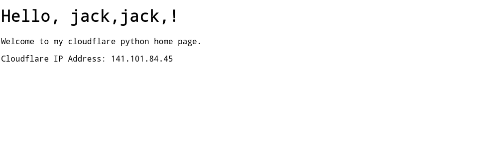

# Cloudflare PHP (cloudflare Python Home Page)

https://dash.cloudflare.com/  >
Workers & Pages > Create > Start from a template/Python Hello World > Edit Code

copy the code of index.py into it, and click "Deploy"

You can modify the "pyml"(html+embeded python) in the pyml variable, the python code in the "<: ... :>"(similar to "<?php ... ?>" in php):

    pyml = """
    <!DOCTYPE html>
    <html lang="en">
    <head>
        <meta charset="UTF-8">
        <meta name="viewport" content="width=device-width, initial-scale=1.0">
        <title>Hello World</title>
    </head>
    <body>
        <h1>Hello, <:for i in range(2):#{#:><:=user_name:>,<:#}#:>!</h1>
        
Welcome to my cloudflare python home page.

    <:response = await fetch("http://httpx.com")
    html=await response.text()
    matches = re.search(r"<h2[^>]*>Your IP Address</h2>.*?<h1[^>]*>(.*?)</h1>", html, re.DOTALL)
    if matches:
        ip_address = matches.group(1).strip()
        text_content = f"Cloudflare IP Address: {ip_address}"
        write.append(text_content)
    else:
        write.append("IP Address not found.")
    :>
    </body>
    </html>
    """
    user_name="jack"

